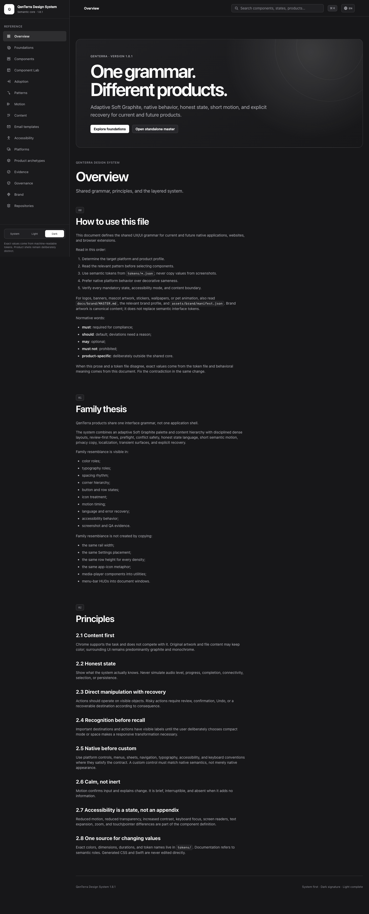

<p align="center">
  <picture>
    <source media="(prefers-color-scheme: dark)" srcset="assets/brand/qenterra/logos/vector/QenTerra%20Logo.svg">
    
  </picture>
</p>

<h1 align="center">QenTerra Design System</h1>

<p align="center">Tokens, components, engineering rules, brand assets, and release evidence for Apple-platform software.</p>

<p align="center">
  <a href="docs/README.md">Documentation</a> ·
  <a href="docs/MASTER.md">English reference</a> ·
  <a href="docs/MASTER.ru.md">Русская версия</a> ·
  <a href="CHANGELOG.md">Changelog</a>
</p>

> **Status:** private, proprietary source of truth. Version `4.1.0` is
> distributed through the private SwiftPM repository
> [`qenterra/design-system-swift`](https://github.com/qenterra/design-system-swift)
> and the restricted GitHub package `@qenterra/design-tokens`.

QDS defines typed tokens, accessible component contracts, SF Symbols, brand
assets, repository standards, and deterministic verification. Platform
conventions remain authoritative for interaction and layout.

## Interface



The generated reference covers English and Russian, System/Light/Dark
appearance, desktop and mobile layouts, accessibility profiles, component
stories, Nyx assets, development guidance, and human-operated email templates.

## Capabilities

- **Foundations:** color, typography, spacing, sizing, radius, borders,
  materials, iconography, layout, density, elevation, and motion.
- **Components and patterns:** executable states, keyboard and assistive
  semantics, localization stress cases, recovery, permissions, destructive
  actions, progress, and responsive behavior.
- **Platform delivery:** generated CSS/JSON assets, typed Swift tokens,
  SwiftUI adapters, SF Symbol names, and opt-in recipes.
- **Development:** requirements, architecture, readable code, commits,
  licensing, review, release, operation, incidents, and retirement.
- **Brand system:** canonical QenTerra marks and Nyx assets with manifest,
  Git LFS, processing boundaries, and focused validation.

## Get started

For a clean checkout:

```sh
npm ci
python3 -m venv .venv
.venv/bin/python -m pip install -r requirements-visual.txt
QDS_IMAGE_PYTHON=.venv/bin/python python3 scripts/verify.py
python3 -m http.server 8000 --directory dist
```

Open `http://localhost:8000/`. The full verifier builds the reference twice,
checks deterministic output, runs unit and package gates, builds and tests the
Swift package, renders the browser matrix, and performs exact screenshot
comparison. See [Building from source](docs/BUILDING.md) for toolchain details.

## How it works

`tokens/*.json`, focused registries and schemas, and the bilingual normative
references are maintained sources. `scripts/build.py` validates those inputs
and generates the reference site, platform adapters, Figma handoff data, and
package payloads. Generated files are committed as evidence and distribution
artifacts, but they are never edited directly.

```text
tokens + registries + docs + src
                 │
                 ▼
          scripts/build.py
                 │
       ┌─────────┼─────────┐
       ▼         ▼         ▼
     dist/    generated/  packages/
```

## Privacy and security

This repository contains design-system sources and synthetic verification
fixtures, not production user data. Do not commit credentials, private product
fixtures, customer content, or AI working directories. Package and release
credentials must stay read-only for consumers and narrowly scoped for
automation. Report vulnerabilities privately as described in
[SECURITY.md](SECURITY.md).

## Development

1. Read the affected section of [the master reference](docs/MASTER.md) and its
   Russian counterpart.
2. Change maintained sources under `tokens/`, `registry/`, `schemas/`, `src/`,
   `docs/`, `templates/`, package manifests, or the hand-authored Swift facade.
3. Run `python3 scripts/verify.py` with the pinned image environment.
4. Inspect the generated HTML and the relevant screenshots at full size.
5. Update `VERSION` and `CHANGELOG.md` for normative changes.

See [CONTRIBUTING.md](CONTRIBUTING.md) for source boundaries and pull-request
expectations.

## Architecture

The repository keeps definition, generation, distribution, and evidence as
separate layers. Product-specific exceptions live in product profiles instead
of weakening shared foundations. Package repositories are filtered release
surfaces; this repository remains the sole owner of token and adapter sources.

See [Architecture](docs/ARCHITECTURE.md), [Dependencies](docs/DEPENDENCIES.md),
and [Maintenance](docs/MAINTENANCE.md).

## Current limitations

- Package verification proves resolution and representative API use, not
  rendering or accessibility inside every consumer product.
- Browser screenshots do not prove native SwiftUI rendering, VoiceOver output,
  hardware behavior, or live external-service boundaries.
- Figma handoff JSON is generated, but a successful build does not prove a
  maintained Figma library was updated.
- Product migration remains explicit consumer work; QDS does not rewrite
  application interfaces automatically. Shocking, yes.

## Documentation

- [Documentation index](docs/README.md)
- [Normative reference](docs/MASTER.md) and [Russian reference](docs/MASTER.ru.md)
- [Component catalog](docs/COMPONENT_CATALOG.md)
- [Consumer adoption](docs/CONSUMER_ADOPTION.md)
- [Code system](docs/CODE.md)
- [Repository standard](docs/repository/STANDARD.md)
- [Brand governance](docs/brand/MASTER.md)
- [Decision records](docs/decisions/)
- [Troubleshooting](docs/TROUBLESHOOTING.md)

## Support and license

Use GitHub Issues for reproducible non-security problems and
`support@qenterra.com` when repository access prevents issue reporting. This
repository is proprietary; use and redistribution require QenTerra
authorization. See [LICENSE](LICENSE).
