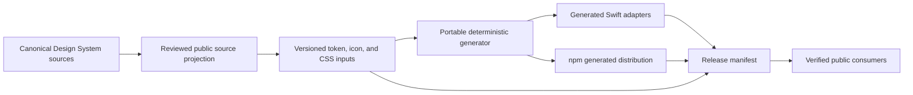

# Architecture

## Context

QenTerra Packages serves web and Apple-platform consumers that need stable design tokens and a small set of reusable interface primitives without access to the private canonical Design System repository.

## System model

## Components

| Component | Responsibility | Inputs and outputs | Owner |
| --- | --- | --- | --- |
| `QenTerraDesignTokens` | Typed foundations and SwiftUI adapters | Swift public API | `@qenterra` |
| `QenTerraComponents` | Maintained reusable SwiftUI primitives | Swift public API built on design tokens | `@qenterra` |
| `@qenterra/design-tokens` | CSS variables, recipes, tokens, and icon metadata | Versioned `src/` inputs; generated `dist/` | `@qenterra` |
| Public generator | Rebuild npm distribution and generated Swift adapters without private source | `npm/design-tokens/src/` to six declared outputs | `@qenterra` |
| `release-manifest.json` | Exact public-file closure | Relative paths, byte sizes, SHA-256 hashes | `@qenterra` |
| Verification scripts | Reject drift and repository contamination | Human-readable pass/fail reports | `@qenterra` |

## Invariants

- All package surfaces share one version.
- Every declared npm and Swift generated file remains byte-reproducible from the versioned public source.
- Release verification regenerates outputs in an external temporary directory before trusting manifest sizes or hashes.
- Every public file except the manifest itself appears exactly once in the manifest.
- Public source never depends on private assets, private paths, agent instructions, skills, caches, or internal repository history.
- Package APIs preserve platform accessibility and native behavior described by their tests and public documentation.

## Failure and recovery

Regeneration, manifest, hash, package, or governance failures stop publication. Correct the public and canonical source together, regenerate a complete projection, and publish a new immutable version. Never repair a released tag or package in place.

## Decisions

Consequential public decisions use records under `docs/decisions/`. Accepted records remain readable when superseded.
