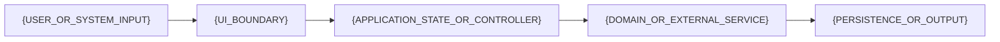

# Architecture

{PROJECT_NAME} is {ONE_PARAGRAPH_STACK_AND_BOUNDARY_SUMMARY}.

## Runtime flow



{EXPLAIN_WHICH_LAYERS_MAY_CALL_NETWORK_STORAGE_FILESYSTEM_ACCOUNT_OR_PLATFORM_APIS}

## Major components

## Module boundaries and change path

Document each module's responsibility, allowed dependencies, and locations of UI, domain policy, storage, network, and platform effects. Name the canonical verification command and the focused tests or live acceptance needed for a safe behavior change.

### Application state

{STATE_OWNERSHIP_OBSERVABILITY_AND_INTENT_FLOW}

### Domain and service boundaries

{DOMAIN_SERVICES_EXTERNAL_APIS_AND_ERROR_MAPPING}

### Persistence

| Store | Purpose | Retention or bound |
| --- | --- | --- |
| `{STORE}` | {PURPOSE} | {BOUND_OR_DELETION_RULE} |

{MIGRATION_CORRUPTION_RECOVERY_AND_ATOMICITY_POLICY}

## Concurrency and lifecycle

- {UI_THREAD_OR_MAIN_ACTOR_RULE}
- {WORKER_ACTOR_SERVICE_WORKER_OR_BACKGROUND_BOUNDARY}
- {CANCELLATION_TIMEOUT_AND_SHUTDOWN_RULE}
- {RELAUNCH_OR_SUSPENSION_RECOVERY_RULE}

## Security and privacy model

- {CREDENTIAL_OR_NO_CREDENTIAL_BOUNDARY}
- {PERMISSION_SANDBOX_HOST_ACCESS_OR_CONTENT_ISOLATION_BOUNDARY}
- {INPUT_PATH_MESSAGE_OR_PROTOCOL_VALIDATION}
- {LOGGING_REDACTION_AND_FIXTURE_ISOLATION}
- {DEPENDENCY_REMOTE_CODE_OR_INTEGRITY_BOUNDARY}

See [Privacy](../PRIVACY.md), [Security](../SECURITY.md), and
[Dependencies](DEPENDENCIES.md).

## Project generation and configuration

`{CONFIGURATION_SOURCE}` is the source of truth. {GENERATED_OUTPUT_POLICY}

```sh
{REGENERATION_OR_CONFIGURATION_COMMAND}
```
